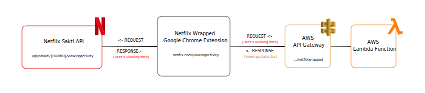

<p style="text-align:center;" align="center">
  

  <h1 align="center">Netflix Wrapped</h1>

  <p align="center">Netflix Wrapped - Your 2020 Netflix year in review</p>

  <p align="center">
    <a href="https://chrome.google.com/webstore/detail/netflix-wrapped/febagoadhbiohapfajddknchglmidhfb?hl=en-GB&authuser=0">Install the Google Chrome Extension</a>
  </p>
</p>

<br/>


Netflix Wrapped - Your 2020 Netflix year in review, in the form of a Google Extension that fetches your viewing history and builds a concise dashboard with all your statistics. Where, this repo holds Google Extension component as well as the AWS Lambda Function of the ‘Netflix Wrapped’ extension. 


The following outlines the statistics you'd see:

- Number of Movies watched
- Time spent watching Movies
- Number of Shows watched
- Time spent watching Shows
- Split between time spent watching Movies vs. Shows (Pie Chart)
- Time spent watching by weekday (Bar Chart)
- Time spent watching by month (Line Graph)
- Top 5 most watched shows

## Instructions
1. Download this extension on the Google Chrome Store from here
2. Open up [Netflix](https://www.netflix.com/ "Netflix") and log into your account 
3. Head over to your viewing activity page via [netflix.com/viewingactivity](https://www.netflix.com/viewingactivity "Netflix Viewing Activity")
4. Click on the `Netflix Wrapped` extension on your toolbar and simply click the `WRAPPED` button

Now just give it a minute or so (depending on how much Netflix you watch) and your Netflix Wrapped dashboard will (should) open up.

<br/>


## Overview

Essentially, when you click the `WRAPPED` button, the extension first fetches the user's viewing history from Netflix's `Shakti` API and then aggregates it into an array. From there, it sends the aggregated data to my `AWS Lambda Function` through the `API Gateway` which then returns the analyzed statistics back to the extension.  

<p style="text-align:center;" align="center">
  
</p>

Then it simply injects all that data into the dashboard. 

<br/>

## Google Extension - Frontend

On one simple click, the Google Extension extracts your accounts full viewing history by querying Netflix’s hidden ‘Shakti’ API through the following request path: 

```
POST /api/shakti/${BuildID}/…
```
Where `${BuildID}` is simply just Shakti’s current build identifier, and at the time of this documentation it happens to be `vb13b96d9`

From here, since the user’s viewing history is fetched 20 `items` at a time, the extension then aggregates all the items and makes `POST` request to my AWS Lambda Backend, which then fully analyzes the aggregated history and returns back the user’s viewing statistics from 2020.  

<br/>

## AWS Lambda Function - Backend


<br/>

## External Libraries Used
- ChartsJS
- Icons8
- Bootstrap


